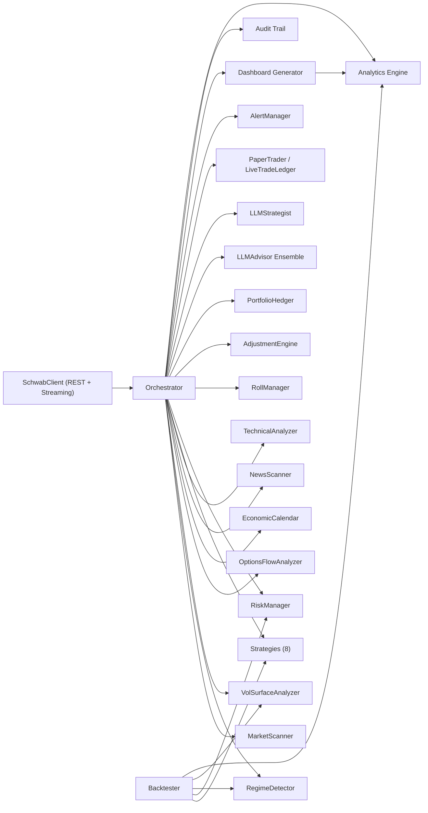

# TradingBot

Production-grade automated options trading bot for Charles Schwab (`schwab-py`) with paper + live execution, multi-strategy intelligence, portfolio-level risk controls, LLM decisioning, and backtest/live analytics.

## Feature Overview

### Market Intelligence
- Regime detection (`BULL_TREND`, `BEAR_TREND`, `HIGH_VOL_CHOP`, `LOW_VOL_GRIND`, `CRASH/CRISIS`, `MEAN_REVERSION`)
- Vol surface analysis (term structure, skew, vol risk premium, vol-of-vol)
- Options flow intelligence (unusual flow, directional bias, institutional conflict filtering)
- Economic calendar filtering (FOMC/CPI/NFP/GDP/PCE/PPI policy hooks)
- News + sentiment (Google RSS + Finnhub + LLM sentiment policy)
- Technical context (RSI, SMA20/50, MACD, ATR, Bollinger, volume ratio)

### Strategies
- Credit spreads
- Iron condors
- Covered calls
- Naked puts
- Calendar spreads
- Strangles/straddles
- Broken wing butterfly
- Earnings volatility crush

### Trade Management
- Smart entry/exit ladder with adaptive width concessions
- Roll manager (profit rolls + defensive rolls) with linked lifecycle metadata
- Adjustment engine (`add_wing`, `roll_tested_side`, `add_hedge`)
- Streaming exit checks with polling fallback
- Adaptive exits + trailing stop persistence

### Risk & Portfolio
- Position + portfolio risk caps
- Portfolio Greeks (delta/theta/gamma/vega)
- Sector concentration guard (GICS map)
- Correlation matrix + correlated-position guard
- VaR guardrails (95/99)
- Kelly/fixed sizing + equity-curve scaling
- Circuit breakers (strategy/symbol/portfolio/API/LLM + VIX/loss breakers)
- Startup reconciliation (orphan/phantom detection)

### LLM Layer
- Google / Anthropic / Ollama providers
- Default cloud model: `gemini-3.1-pro-thinking-preview`
- Responses API with Chat Completions fallback
- Ensemble voting + model-accuracy weighting
- Confidence calibration buckets
- Portfolio strategist directives
- Trade journal feedback loop

### Observability & Reporting
- Structured audit trail (`bot/data/audit_log.jsonl`)
- Execution quality + slippage tracking
- Analytics engine (`bot/analytics.py`)
- Self-contained HTML dashboard (`logs/dashboard.html`)
- Backtester with walk-forward, Monte Carlo, regime tagging, costs/slippage
- Webhook alerts (generic/Slack/Discord)

## Architecture



## Quick Start (Paper Mode in ~5 Minutes)

1. Install dependencies:
```bash
pip install -r requirements.txt
```
2. Create env file:
```bash
cp .env.example .env
```
3. Set Schwab + optional LLM keys in `.env`:
- `SCHWAB_APP_KEY`
- `SCHWAB_APP_SECRET`
- `SCHWAB_ACCOUNT_HASH` (or `SCHWAB_ACCOUNT_INDEX`)
- `GOOGLE_API_KEY` (if `LLM_PROVIDER=google`)
4. Run paper bot:
```bash
python3 main.py
```
5. Optional one-shot + diagnostics:
```bash
python3 main.py run paper once
python3 main.py run paper --diagnose
```

## CLI Reference

```bash
# Core runtime
python3 main.py
python3 main.py run paper
python3 main.py run paper once
python3 main.py run paper --diagnose
python3 main.py run live --yes
python3 main.py run live once --yes
python3 main.py run live --diagnose

# Auth
python3 main.py auth
```

## Codex Agent Team Workflow

If you want a Claude-style "agent team" setup with Codex, use the local team runner:

```bash
python3 scripts/codex_team.py --task "Add a new risk guard for earnings week and update tests"
```

What it does:
- Launches specialist Codex agents in parallel (`architect`, `reviewer`, `tester`) in `read-only` mode.
- Saves each specialist prompt/report under `.codex-team/runs/<timestamp>/`.
- Runs a lead Codex agent in `workspace-write` mode to execute the task using those reports.

Useful flags:

```bash
# Specialists only (no code changes)
python3 scripts/codex_team.py --task "..." --skip-lead

# Choose roles and model
python3 scripts/codex_team.py --task "..." --roles architect,tester --model gpt-5

# Print underlying codex commands without running them
python3 scripts/codex_team.py --task "..." --dry-run

# Spawn a separate Terminal window for each specialist/lead agent
python3 scripts/codex_team.py --task "..." --spawn-terminal-windows

# Fail fast if nested codex runs hang
python3 scripts/codex_team.py --task "..." --specialist-timeout-seconds 120 --lead-timeout-seconds 600
```

Prompt shortcut:
- In Codex chat for this repo, include `agent team` in your prompt (for example, `agent team add trailing stop diagnostics`) and the assistant will run `scripts/codex_team.py` automatically (with terminal windows).

## Configuration Reference

All keys are backward-compatible and default to non-breaking values.

| Section | Purpose | Key examples |
|---|---|---|
| `strategies.*` | Strategy enablement + parameters | `credit_spreads.min_dte`, `strangles.min_iv_rank`, `earnings_vol_crush.wing_width` |
| `risk` | Core risk constraints | `max_portfolio_risk_pct`, `min_trade_score`, `min_trade_pop`, `max_contracts_per_trade` |
| `risk_profiles` | Named multi-account presets | `conservative`, `moderate`, `aggressive` |
| `sizing` | Position sizing engine | `method`, `kelly_fraction`, `equity_curve_scaling`, `high_conviction_size_boost_*` |
| `regime` | Regime detector controls | `enabled`, `cache_seconds`, `history_file` |
| `vol_surface` | Vol-based trade gating | `require_positive_vol_risk_premium`, `max_vol_of_vol_for_condors` |
| `econ_calendar` | Macro event policy | `high_severity_policy`, `medium_severity_policy` |
| `options_flow` | Flow anomaly sensitivity | `unusual_volume_multiple` |
| `rolling` | Roll triggers/limits | `min_dte_trigger`, `max_rolls_per_position` |
| `exits` | Adaptive exits + trailing stops | `adaptive_targets`, `trailing_stop_*` |
| `adjustments` | Multi-leg defense controls | `delta_test_threshold`, `max_adjustments_per_position` |
| `hedging` | Portfolio hedge layer | `enabled`, `auto_execute`, `max_hedge_cost_pct` |
| `llm` | Trade advisor controls | `provider`, `model`, `ensemble_*`, `journal_*` |
| `llm_strategist` | Cycle-level directives | `enabled`, `provider`, `max_directives` |
| `news` | News/sentiment sources | `provider`, `finnhub_api_key`, `llm_sentiment_*` |
| `execution` | Live order behavior | `smart_ladder_enabled`, `ladder_width_fractions`, `block_first_minutes` |
| `signal_ranking` | Cross-strategy capital routing | `enabled`, `weight_score`, `weight_pop`, `weight_credit`, `weight_vol_premium` |
| `alerts` | Webhook + summary behavior | `trade_notifications`, `daily_summary`, `webhook_format` |
| `circuit_breakers` | Safety kill-switch controls | `strategy_loss_streak_limit`, `portfolio_drawdown_halt_pct` |
| `degradation` | Fault-tolerant fallbacks | `fallback_watchlist_on_scanner_failure`, `rule_only_on_llm_failures` |

## Performance Analytics

`bot/analytics.py` computes reusable metrics consumed by dashboard, alerts, and backtester:
- Sharpe, Sortino, Calmar
- Max drawdown + drawdown duration
- Win rate, profit factor, expectancy
- Avg win/loss ratio
- Current/max consecutive wins/losses
- Risk-adjusted return (return per deployed risk)
- Strategy/regime/monthly breakdowns
- Daily P&L map for calendar/curve rendering

## Deployment

### systemd (Linux)

1. Create service unit (`/etc/systemd/system/tradingbot.service`):
```ini
[Unit]
Description=TradingBot
After=network.target

[Service]
Type=simple
WorkingDirectory=/path/to/TradingBot
ExecStart=/usr/bin/python3 main.py
Restart=always
RestartSec=10
Environment=PYTHONUNBUFFERED=1

[Install]
WantedBy=multi-user.target
```
2. Enable/start:
```bash
sudo systemctl daemon-reload
sudo systemctl enable tradingbot
sudo systemctl start tradingbot
sudo systemctl status tradingbot
```

### launchd (macOS)

1. Create plist at `~/Library/LaunchAgents/com.tradingbot.plist`:
```xml
<?xml version="1.0" encoding="UTF-8"?>
<!DOCTYPE plist PUBLIC "-//Apple//DTD PLIST 1.0//EN" "http://www.apple.com/DTDs/PropertyList-1.0.dtd">
<plist version="1.0">
<dict>
  <key>Label</key><string>com.tradingbot</string>
  <key>ProgramArguments</key>
  <array>
    <string>/usr/bin/python3</string>
    <string>/path/to/TradingBot/main.py</string>
  </array>
  <key>WorkingDirectory</key><string>/path/to/TradingBot</string>
  <key>RunAtLoad</key><true/>
  <key>KeepAlive</key><true/>
</dict>
</plist>
```
2. Load:
```bash
launchctl load ~/Library/LaunchAgents/com.tradingbot.plist
launchctl list | grep tradingbot
```

## Troubleshooting

### `Token file not found`
- Run:
```bash
python3 -m bot.auth
```
- Confirm `SCHWAB_TOKEN_PATH` points to the generated token file.

### Live readiness fails on configuration validation
- Run:
```bash
python3 main.py run live --diagnose
```
- Fix reported `Configuration validation report` failures before live mode.

### LLM provider failures or timeouts
- Verify `GOOGLE_API_KEY`.
- If unavailable, set `llm.enabled: false` or keep advisory mode + degradation fallback.

### No entries despite scans
- Check circuit breaker state in dashboard (`halt_entries`, cooldown timestamps).
- Verify scanner blacklist and min score gates.
- Check regime/vol-surface filters are not zeroing strategy weights.

### Dashboard missing data
- Ensure write access to `logs/` and `bot/data/`.
- Run a one-shot cycle to refresh generated dashboard artifacts:
```bash
python3 main.py run paper once
```

## Testing

```bash
python3 -m pytest -q
```

## Disclaimer

Options trading is high risk. Validate in paper mode first, use conservative limits, and monitor all live safety controls before deploying real capital.
