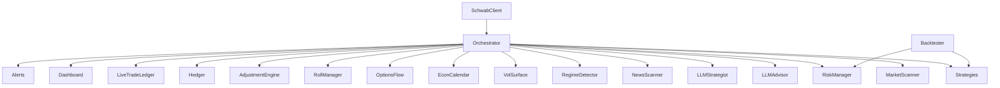

# TradingBot

Production-grade automated options trading bot for Charles Schwab (`schwab-py`) with paper + live execution, multi-strategy scanning, portfolio risk controls, LLM-assisted decisioning, and analytics/backtesting.

## Core Capabilities

- Strategies:
  - Credit spreads (bull put / bear call)
  - Iron condors
  - Covered calls
  - Naked puts (cash-secured)
  - Calendar spreads
  - Short strangles / index straddles
  - Broken wing butterfly
  - Earnings volatility crush
- Portfolio risk engine:
  - position + portfolio risk limits
  - portfolio Greeks (delta/theta/gamma/vega)
  - sector concentration guard
  - correlation guard + correlation matrix
  - VaR limits (95/99)
  - Kelly/fixed sizing modes
- Intelligence layers:
  - market regime detector
  - vol-surface analyzer
  - economic calendar filter
  - options-flow analyzer
  - technical context (RSI, SMA, MACD, ATR, Bollinger, volume ratio)
  - news scanner (Google RSS + Finnhub + LLM sentiment)
- LLM system:
  - OpenAI / Anthropic / Ollama providers
  - default OpenAI model: `gpt-5.2-pro`
  - Responses API with Chat Completions fallback
  - optional ensemble voting
  - cycle-level LLM portfolio strategist
  - verdict track record + trade journal feedback loop
- Execution & resilience:
  - smart order ladder (entry/exit)
  - live ledger reconciliation
  - startup state recovery
  - websocket streaming with polling fallback
  - circuit breakers + graceful degradation
  - graceful SIGTERM/SIGINT shutdown with pending-order cancellation
- Analytics:
  - historical backtester (walk-forward, Monte Carlo, costs/slippage, regime-tagged stats)
  - HTML dashboard (auto-refresh, Greeks, VaR, correlation heatmap, circuit state, LLM accuracy)
  - webhook alerts (generic / Slack / Discord formats)

## Architecture



## Quick Start

1. Install dependencies:

```bash
pip install -r requirements.txt
```

2. Configure environment:

```bash
cp .env.example .env
```

3. Set required keys in `.env`:

- `SCHWAB_APP_KEY`
- `SCHWAB_APP_SECRET`
- `SCHWAB_ACCOUNT_HASH` (or `SCHWAB_ACCOUNT_INDEX`)
- `OPENAI_API_KEY` (if `LLM_PROVIDER=openai`)

4. Run in paper mode:

```bash
python3 main.py
```

5. Live setup / validation:

```bash
python3 main.py --prepare-live
python3 main.py --setup-live
python3 main.py --live-readiness-only
```

## CLI

```bash
python3 main.py --once
python3 main.py --report
python3 main.py --dashboard
python3 main.py --fetch-data --start 2024-01-01 --end 2025-12-31
python3 main.py --backtest --start 2024-01-01 --end 2025-12-31
python3 main.py --live --yes
```

## Configuration

- Primary config file: `config.yaml`
- Environment overrides: `.env` (see `.env.example`)
- New advanced sections in `config.yaml`:
  - `sizing`, `regime`, `vol_surface`, `econ_calendar`, `options_flow`
  - `rolling`, `exits`, `adjustments`, `hedging`
  - `llm_strategist`, `circuit_breakers`, `degradation`
  - `risk_profiles`, expanded `risk` (correlation + VaR)
  - expanded `alerts` and `execution`

All advanced features are toggleable and default to non-breaking values.

## Data & Artifacts

- Runtime data: `bot/data/`
- Logs/reporting: `logs/`
- Key persisted files include:
  - `bot/data/iv_history.json`
  - `bot/data/earnings_cache.json`
  - `bot/data/econ_calendar.json`
  - `bot/data/llm_track_record.json`
  - `bot/data/trade_journal.json`
  - `bot/data/execution_quality.json`
  - `bot/data/scanner_history.json`
  - `bot/data/sector_map.json`

## Testing

```bash
python3 -m pytest -q
```

## Disclaimer

Options trading has substantial risk. Use paper mode first, validate behavior thoroughly, and apply conservative limits before enabling live trading.
